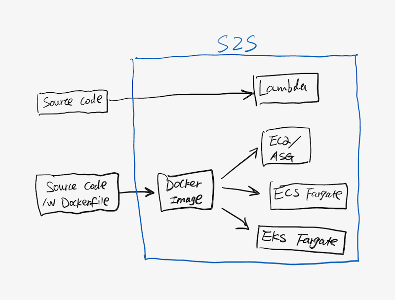

# S2S (Source to Service)

## Overview

The idea is to simplify the code deployment on various AWS services - Give your source code and config file to S2S, it will give you back the running service.

User can specify the deployment pattern for their code/application in the config file. For example, here are some typical deployment patterns:

- Lambda
- Lambda + API gateway
- ECS/EKS fargate
- ECS/EKS fargate + ALB
- ASG
- ASG + ALB

## Design

